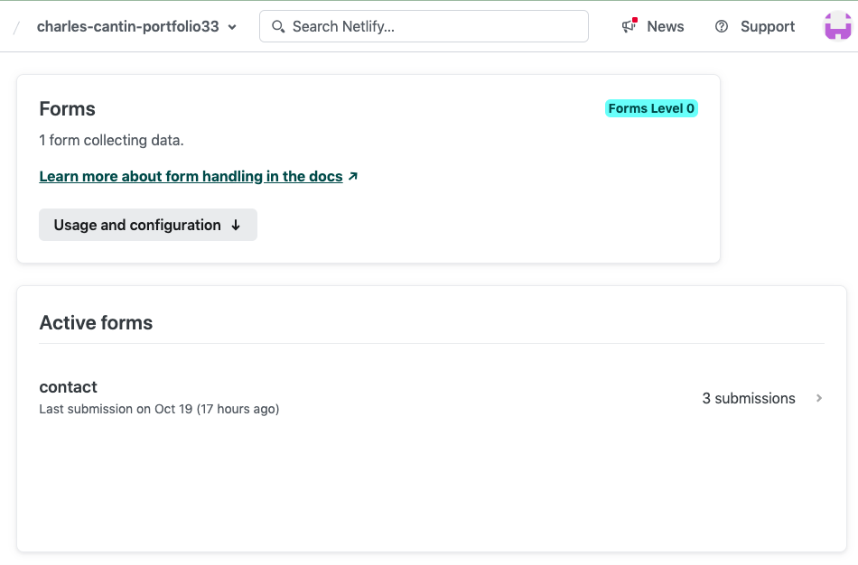
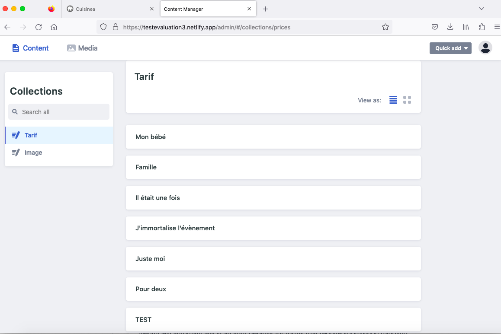

# Projet Charles Cantin - Photographe

## Description

Pour cette évaluation d'entraînement qui est essentiellement axée sur le Développement de la partie front-end d’une application web, le projet consiste à créer un portfolio pour un photographe.

Le site devait contenir 4 pages (accueil, galerie, tarifs et contact).

L'intérêt de cet exercice a été d'utiliser un générateur de site statique, j'ai donc choisi Eleventy que j'ai couplé à un CMS headless tel que NetlifyCMS. Cela afin de permettre au propriétaire du site d’ effectuer lui-même les modifications qu'il souhaite.

Les documents annexes sont disponibles dans le dossier "annexes" :

- Charte graphique, Wireframes et Mockups

Le maquettage a été réalisé sur Figma.
Il est visible à cette adresse : https://www.figma.com/file/jWYUfCqXwmuelM1woK1Nf4/Maquette-Charles-Cantin?type=design&node-id=0-1&mode=design&t=NCuFvEPWg3Z40Yol-0

Lien du site: https://charles-cantin-portfolio33.netlify.app/

## Eleventy

1. Eleventy v2.0.1 nécessite Node.js.Vous pouvez vérifier si Node est installé ou non en l’exécutant `node -v` dans une fenêtre de terminal.
2. Créez un répertoire pour votre projet
3. Installer Eleventy. Pour cela:
   - CRÉER UN package.json en tapant `npm init -y`
   - Installer Eleventy en tapant `npm install @11ty/eleventy --save-dev`
4. Exécuter Eleventy avec `npx @11ty/eleventy`. Nous pouvons par la suite utiliser `npx @11ty/eleventy --serve` une fois cela nous évite de taper `npx @11ty/eleventy` à chaque modification
5. Dans la ligne de commande, nous aurons l'adresse du site locale qui peut ressembler à http://localhost:8080/ à copier dans notre navigateur Web
   Lorsque vous enregistrez vos fichiers de modèle, Eleventy actualisera automatiquement le navigateur avec vos nouvelles modifications !

## Netlify

### 1- Inscription sur Netlify

Aller sur le site https://www.netlify.com/ et créer un compte

### 2- Déployer le site

Une fois l'inscription faite, connectez vous et accédez à votre tableau de bord principal.

Cliquez sur "Add new site" et choisissez l'option qui vous convient

Import an existing project : permet d'importer votre projet à partir de GitHub, GitLab, Bitbucket ...

Deploy manually : permet de deployer son site manuellement (drag and drop)

### 3- Accéder à votre site

Vous pouvez voir sur le tableau de bord (sites) votre site déployé .

Enfin, pour accéder à votre site cliquer sur le nom de domaine (https://...). Nom de domaine modifiable avec change site name

### 4- Accéder à votre formulaire

Vous pouvez également accéder à votre formulaire via le bouton Forms

Cliquer sur Enable form detection, il détectera automatiquement votre formulaire.

Une fois sur le tableau de bord principal de la section Forms, vous trouverez tout vos formulaires, cliquez sur l'un d'eux pour y accéder

Une fois dans votre formulaire vous pourrez lire tout les messages reçus dans la section Active forms (voir ci-dessous)

### 5- Modifier le contenu de votre site web avec NetlifyCMS

Pour modifier le contenu de votre site web, accédez au site à l'adresse que je vous ai envoyé en ajoutant /admin dans la barre de navigation.

Connectez-vous avec les identifiants que je vous ai fournis.

Vous arriverez sur la page ci-dessous:

Vous pouvez ensuite accéder à la rubrique Tarif ou Image. Vous pourrez ainsi créer, modifier, supprimer les tarifs.

Idem pour les images mais attention il faudra bien choisir la catégorie de l'image lors de l'ajout pour que le filtre fonctionne et que l'image soit ajoutée à la bonne catégorie.
